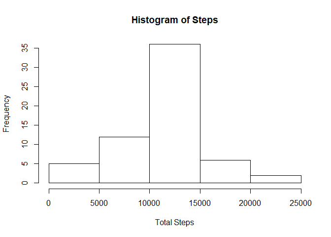

## Loading and preprocessing the data

```r
data <- read.csv("./activity_data/activity.csv")
data$date <- as.Date(data$date)
```

## What is mean total number of steps taken per day?

```r
dataperday <- tapply(data$steps, data$date, sum)
df <- data.frame("Day" = as.Date(names(dataperday)), "TotalSteps" = dataperday)
hist(x = df$TotalSteps, xlab = "Total Steps", main = "Histogram of Steps")
```

<!-- -->

```r
steps_mean <- mean(df$TotalSteps, na.rm = TRUE)
steps_median <- median(df$TotalSteps, na.rm = TRUE)

steps_mean
```

```
## [1] 10766.19
```

```r
steps_median
```

```
## [1] 10765
```

## What is the average daily activity pattern?

```r
library(plyr)
time_interval_data <- ddply(data, .(interval), summarize, average = mean(steps, na.rm = TRUE))
plot(time_interval_data, type = "l")
```

<!-- -->

```r
sorted <- time_interval_data[rev(order(time_interval_data$average)),]
# Highest number of steps in the given interval
sorted[1,]
```

```
##     interval  average
## 104      835 206.1698
```

## Imputing missing values

```r
## Total Number of Rows with NAs
sum(!complete.cases(data))
```

```
## [1] 2304
```

```r
##replace NA with average steps over all days in that particular interval
id <- 1:nrow(data)
complete_data <- data
for(i in id) {
        if(is.na(complete_data[i, 1])) {
                complete_data[i, 1] <- time_interval_data[time_interval_data$interval == complete_data[i,3],2]
        }
}
dataperday_complete <- tapply(complete_data$steps, complete_data$date, sum)
df_complete <- data.frame("Day" = as.Date(names(dataperday_complete)), "TotalSteps" = dataperday_complete)
hist(x = df_complete$TotalSteps, xlab = "Total Steps", main = "Histogram of Steps")
```

<!-- -->

```r
steps_mean_complete <- mean(df_complete$TotalSteps, na.rm = TRUE)
steps_median_complete <- median(df_complete$TotalSteps, na.rm = TRUE)

steps_mean_complete
```

```
## [1] 10766.19
```

```r
steps_median_complete
```

```
## [1] 10766.19
```


## Are there differences in activity patterns between weekdays and weekends?
